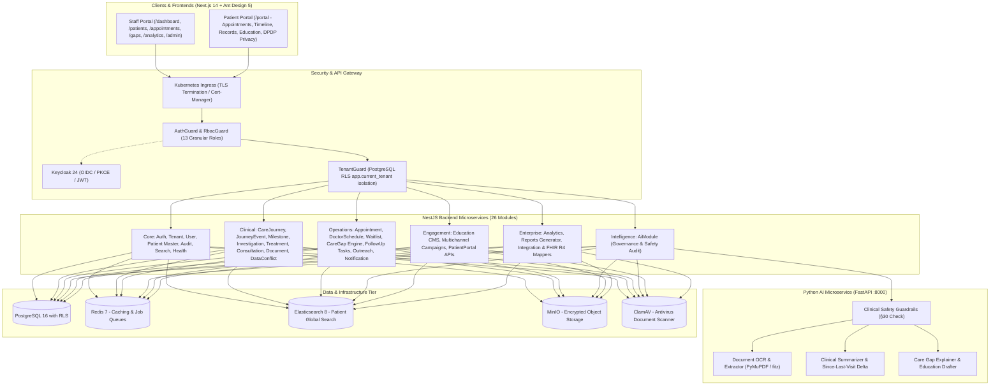

# CancerCare360 — Cancer Care Continuity, Intelligence & Operations Platform

[](#)
[](#)
[](#)
[](#)
[](#)

A complete, enterprise-grade, multi-tenant SaaS platform engineered specifically for oncology departments and cancer centers. CancerCare360 bridges the critical gaps between consultations, diagnostic workups, and ongoing therapeutic cycles to eliminate lost-to-follow-up scenarios and accelerate clinical decision-making.

---

## Architecture Overview



---

## Key Modules & Core Capabilities

### 1. Clinical Workflows & Oncology Continuity
- **Longitudinal Care Journeys**: Staged cancer progression tracking (`SCREENING` → `DIAGNOSIS` → `TREATMENT_PLANNING` → `ACTIVE_TREATMENT` → `SURVIVORSHIP` → `PALLIATIVE`) with cancer-site specific milestone automation.
- **Consultation Readiness Briefing (§10)**: 13 parallel database queries synthesizing new diagnostic reports, vitals, document diffs, and toxicities since the last doctor consultation into a high-density, 60-second summary.
- **Diagnostic Turnaround (TAT) Engine**: Live SLA benchmarks from order entry to path/rad report sign-off.
- **Document Vault**: Encrypted MinIO storage with ClamAV virus scanning, MD5/SHA256 integrity verification, and conflict detection.

### 2. Clinic Flow & Operations
- **4-Column Real-Time Clinic Flow Kanban Board**: Drag-and-drop clinic tracking (`Scheduled` → `Checked In / Waiting` → `In Consultation` → `Completed`) with automated wait-time color alerts.
- **Conflict-Free Slot Booking Wizard**: 4-step wizard calculating real-time availability from doctor template schedules.
- **Automated Care Gap Detection (§13, §14)**: Continuously scans for:
  1. `OVERDUE_MILESTONE`
  2. `MISSED_APPOINTMENT`
  3. `PENDING_INVESTIGATION`
  4. `MISSING_FOLLOW_UP`
  5. `TREATMENT_DELAY`
- **Coordinator Outreach Queue**: Prioritized contact task list with multi-channel logging (Phone, WhatsApp, SMS, Email, Portal) and auto-task resolution.

### 3. Intelligence & AI Governance (§28–§30)
- **PyMuPDF OCR & Entity Extraction**: Microservice for parsing semi-structured lab and pathology PDFs.
- **Strict Non-Autonomous Clinical Boundaries (§30)**:
  - Programmatic rejection of autonomous diagnosis, staging, and medication dosing.
  - Mandatory disclaimer on all outputs: *"CLINICAL DECISION SUPPORT ONLY. Verification by treating oncologist required."*
- **Hospital Governance Dashboard (`/admin/ai`)**: Per-tenant capability switches, confidence scoring thresholds, and clinician review tracking (`ACCEPTED`, `REJECTED`, `MODIFIED`).

### 4. Patient Engagement & DPDP Act 2023 Compliance
- **Patient Portal (`/portal`)**: Upcoming appointments, treatment timeline in plain language, signed document viewer, and trilingual educational library (English, हिंदी, मराठी).
- **DPDP Act 2023 & ABDM Consent**: Granular channel preferences (WhatsApp, SMS, Email) and ABDM consent artefact management with immutable audit logs for consent granting and revocation.

### 5. Enterprise Analytics & Interoperability
- **Role-Specific Dashboards (`/dashboard`)**: Live viewports for Oncologist, Care Coordinator, HOD, and Administrator.
- **HL7 FHIR R4 Mappers**: Standardized adapters for `Patient`, `Encounter`, `Condition`, `CarePlan`, and `DiagnosticReport`.
- **Automated Backup & Disaster Recovery**: RPO < 1 hour, RTO < 4 hours with point-in-time recovery scripts.

---

## Verification & Test Results

| Component | Verification Command | Exit Code | Result |
|---|---|:---:|---|
| **Frontend Web** | `npm run build` (Next.js 14.1.0) | `0` | **30/30 static and dynamic routes compiled** |
| **Backend API** | `npx tsc --noEmit` & `npm run build` | `0` | **0 type errors; clean `dist/` compilation** |
| **Backend Unit Tests** | `npm test` (Jest) | `0` | **8/8 unit tests passed across 3 test suites** |
| **AI Microservice** | `python -m compileall .` | `0` | **100% bytecode & syntax verification** |
| **AI Safety Tests** | `python tests/test_guardrails.py` | `0` | **6/6 §30 clinical guardrail tests passed** |
| **Prisma Engine** | `npx prisma generate` | `0` | **Prisma Client v5.22.0 across 30+ tables** |

---

## Quickstart Guide

### Option 1: Full Orchestration via Docker Compose
Once Docker Desktop is active on your machine:
```bash
docker compose up -d --build
```
This boots all 8 services:
- **Web Frontend:** http://localhost:3000
- **Backend API & Swagger Docs:** http://localhost:3001/api/docs
- **AI Microservice:** http://localhost:8000/docs
- **Keycloak IAM:** http://localhost:8080
- **MinIO S3 Console:** http://localhost:9001 (Credentials: `admin` / `admin123`)
- **PostgreSQL 16:** `localhost:5432`
- **Redis 7:** `localhost:6379`
- **Elasticsearch 8:** `localhost:9200`

### Option 2: Local Development Execution

#### 1. Database Setup & Seeding
```bash
cd backend
# Push schema to PostgreSQL
npx prisma db push

# Seed platform tenants, oncologists, patients, and care journeys
npx ts-node prisma/seed.ts
```

#### 2. Start Backend API
```bash
cd backend
npm run start:dev
```

#### 3. Start Frontend Web
```bash
cd frontend
npm run dev
```

#### 4. Start AI Service
```bash
cd ai-service
python -m uvicorn main:app --reload --port 8000
```

---

## Default Seed Credentials

| Role | Email | Password | Scope |
|---|---|---|---|
| **Platform Administrator** | `admin@cancercare360.com` | `admin123` | Platform-wide administration |
| **Consultant Oncologist** | `doctor@cityhospital.com` | `doctor123` | City General Hospital - Medical Oncology |
| **Care Coordinator** | `coordinator@cityhospital.com` | `coordinator123` | City General Hospital - Patient Navigation |
| **Demo Patient** | `priya.sharma@example.com` | `patient123` | Patient Portal (MRN: `MRN-ONC-2026-001`) |

---

## Regulatory & Standards Compliance
- **Digital Personal Data Protection (DPDP) Act 2023**: Section 6 & 7 compliant consent capture, withdrawal, and purpose-bound audit logs.
- **Ayushman Bharat Digital Mission (ABDM)**: M1 (ABHA Creation), M2 (Health Information Provider - HIP), and M3 (Health Information User - HIU) milestone architecture with FHIR R4 compliance.
- **Clinical Safety Boundary (§30)**: Non-autonomous decision boundaries, mandatory oncological disclaimers, and zero automated prescribing.
- **Data Privacy**: Multi-tenant isolation enforced at the PostgreSQL database engine level using Row-Level Security (RLS) policies.
